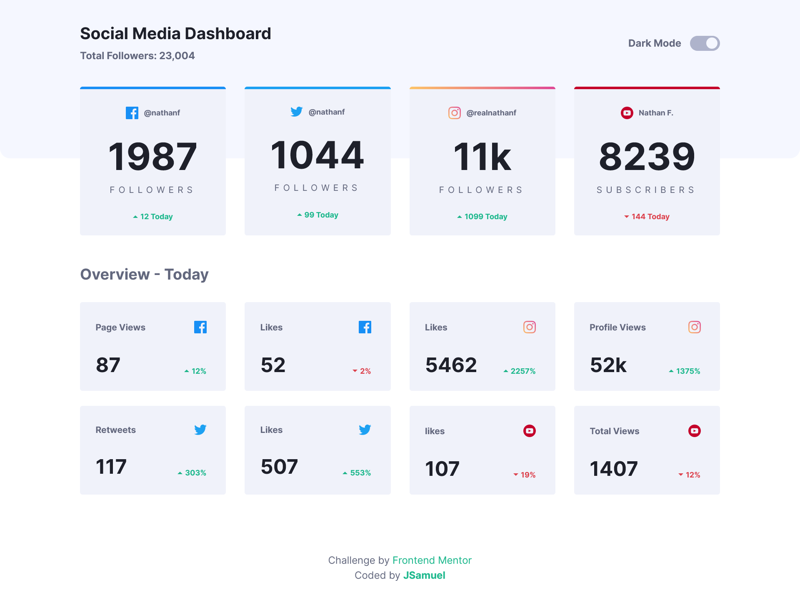
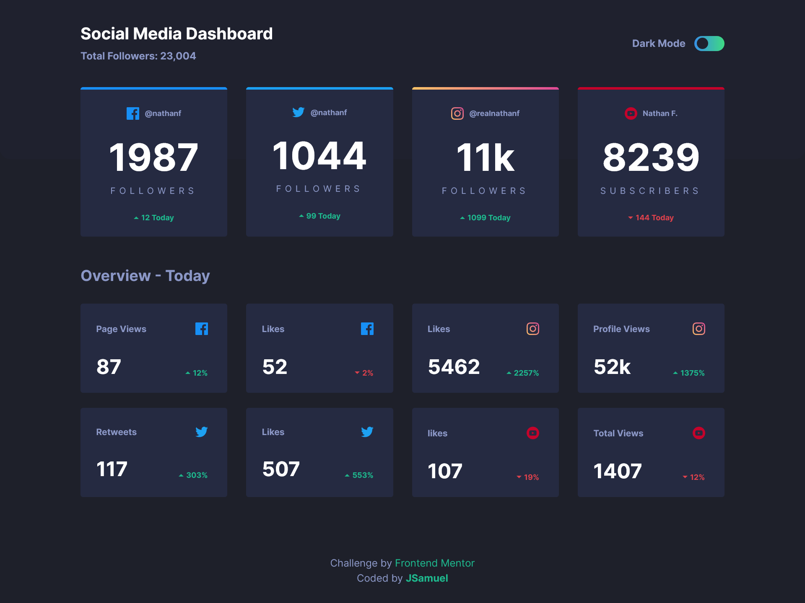

# Frontend Mentor - Social media dashboard with theme switcher solution ☀️🌙

This is a solution to the [Social media dashboard with theme switcher challenge on Frontend Mentor](https://www.frontendmentor.io/challenges/social-media-dashboard-with-theme-switcher-6oY8ozp_H). Frontend Mentor challenges help you improve your coding skills by building realistic projects.

## Table of contents 🧾

- [Overview 👀](#overview)
  - [The challenge 🎯](#the-challenge)
  - [Screenshot 📷](#screenshot)
  - [Links 🔗](#links)
- [My process 🏗️](#my-process)
  - [Built with 🧰](#built-with)
  - [What I learned 🧠](#what-i-learned)
  - [Useful resources 📚](#useful-resources)
- [Author ✒️](#author)

## Overview 👀

### The challenge 🎯

Users should be able to:

- View the optimal layout for the site depending on their device's screen size
- See hover states for all interactive elements on the page
- Toggle color theme to their preference

### Screenshot 📷




### Links 🔗

- Solution URL: [Frontend Mentor](https://your-solution-url.com)
- Live Site URL: [Github Pages](https://your-live-site-url.com)

## My process 🏗️

### Built with 🧰

- Semantic HTML5 markup
- CSS custom properties
  - [Normalize CSS](https://necolas.github.io/normalize.css/)
- [SASS](https://sass-lang.com/) - CSS preprocessor
  - 7-1 Pattern
- Flexbox
- CSS Grid
- Mobile-first workflow
- [React](https://reactjs.org/) - JS library
  - Hooks
  - Custom Hooks
  - Context API
- [Vite](https://main.vitejs.dev/) - Build Tool
- [gh-pages](https://www.npmjs.com/package/gh-pages) - Deploy module

### What I learned 🧠

I asked me when I have to use **.js** or **.jsx** in React files, until Vite throw an error where it couldn't read **JSX syntax** in a .js file, so I learned, if a file contains JSX, is preferable name it with .jsx.

When I was styling the cards, I had problems with the border top of Instagram card, `border-color` **can't have a gradient** as value. Researching I found a CSS property that allows it:

```css
border-image: linear-gradient(yellow, pink) 1;
```

At the end I didn't use this property because it can't be rounded with `border-radius`, I used pseudo elements better, but I learned new things 😁.

Finally I learned **how to deploy** a React proyect with **Vite** and **gh-pages** npm module:

```js
export default defineConfig({
	plugins: [react()],
	base: "/social-media-dashboard/",
});
```

```bash
npm run deploy
```

### Useful resources 📚

- [SASS 7-1 Pattern](https://www.easeout.co/blog/2020-08-25-structuring-your-sass-projects/) - This post talks about a architecture for structure the SASS folders.
- [Conventional Commits](https://www.conventionalcommits.org/en/v1.0.0/) - This specificacion helped me to write better commit messages.
- [Deploying a Static Site](https://vitejs.dev/guide/static-deploy.html#github-pages) - Steps for deploy a proyect in Github pages with Vite.

## Author ✒️

- Website - [JSamuel](https://jsamuelap.github.io)
- Github - [@JSamuelAP](https://github.com/JSamuelAP)
- Frontend Mentor - [@JSamuelAP](https://www.frontendmentor.io/profile/JSamuelAP)
- LinkedIn - [@JSamuelAP](https://www.linkedin.com/in/jsamuelap)
- Twitter - [@JSamuelAP](https://www.twitter.com/yourusername)
- Email - [sp4619168@gmail.com](mailto:sp4619168@gmail.com)
